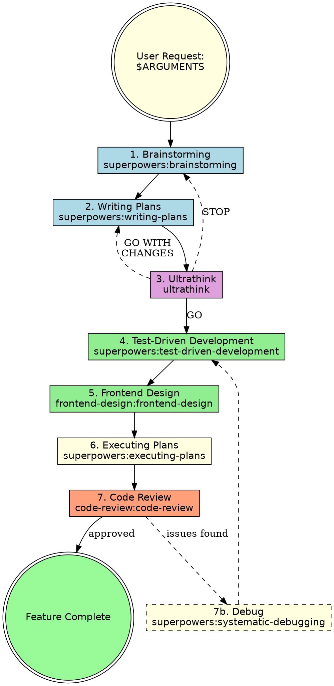

# Feature Development Workflow

Structured 7-phase workflow for building new features with quality gates at each step.

## Usage

```
/feature-workflow <feature description>
```

Example: `/feature-workflow add user preferences page`

## The Workflow



## Steps

### Step 1: Brainstorming
**REQUIRED:** Use `superpowers:brainstorming`

Explore the user's intent, gather requirements, and design the feature before any code is written. Do not skip this step — even if the feature seems straightforward, brainstorming surfaces edge cases and clarifies scope.

### Step 2: Writing Plans
**REQUIRED:** Use `superpowers:writing-plans`

Create a detailed implementation plan based on brainstorming output. The plan should include file paths, architecture decisions, and verification steps.

### Step 3: Ultrathink
**REQUIRED:** Use `ultrathink`

Deep critical analysis of the design spec and implementation plan against the actual codebase. Examines 6 dimensions: edge cases, security, performance, architecture compliance, migration/dependency risk, and failure modes. Produces a written analysis document with a gate verdict:
- **GO** → Proceed to TDD
- **GO WITH CHANGES** → Amend the plan, then proceed
- **STOP** → Return to brainstorming for redesign

### Step 4: Test-Driven Development
**REQUIRED:** Use `superpowers:test-driven-development`

Write failing tests first, then implement code to make them pass. This ensures the feature works correctly and prevents regressions.

### Step 5: Frontend Design
**REQUIRED:** Use `frontend-design:frontend-design`

Build polished, production-grade UI components. Follow the project's existing CSS conventions (inline styles with unique prefixes, Alpine.js + Livewire patterns).

### Step 6: Executing Plans
**REQUIRED:** Use `superpowers:executing-plans`

Execute the implementation plan with review checkpoints. Follow the plan step-by-step, verifying each phase before moving to the next.

### Step 7: Code Review
**REQUIRED:** Use `code-review:code-review`

Review all completed work for quality, correctness, and adherence to the plan. If issues are found, proceed to Debug (Step 7b).

### Step 7b: Debug (Optional)
**OPTIONAL:** Use `superpowers:systematic-debugging`

Triggered only when Code Review (Step 7) finds issues. Applies structured debugging methodology to diagnose root causes before fixing. After debugging, loop back to Step 4 (TDD) to write regression tests and implement fixes.

## Integration

**Required workflow skills (all 7 are mandatory):**
- **superpowers:brainstorming** — REQUIRED: Explore intent and design before coding
- **superpowers:writing-plans** — REQUIRED: Create detailed implementation plan
- **ultrathink** — REQUIRED: Deep critical analysis before writing code
- **superpowers:test-driven-development** — REQUIRED: Write tests before implementation
- **frontend-design:frontend-design** — REQUIRED: Build polished UI
- **superpowers:executing-plans** — REQUIRED: Execute plan with checkpoints
- **code-review:code-review** — REQUIRED: Review completed work

**Optional workflow skills:**
- **superpowers:systematic-debugging** — OPTIONAL: Systematic debugging when code review finds issues
